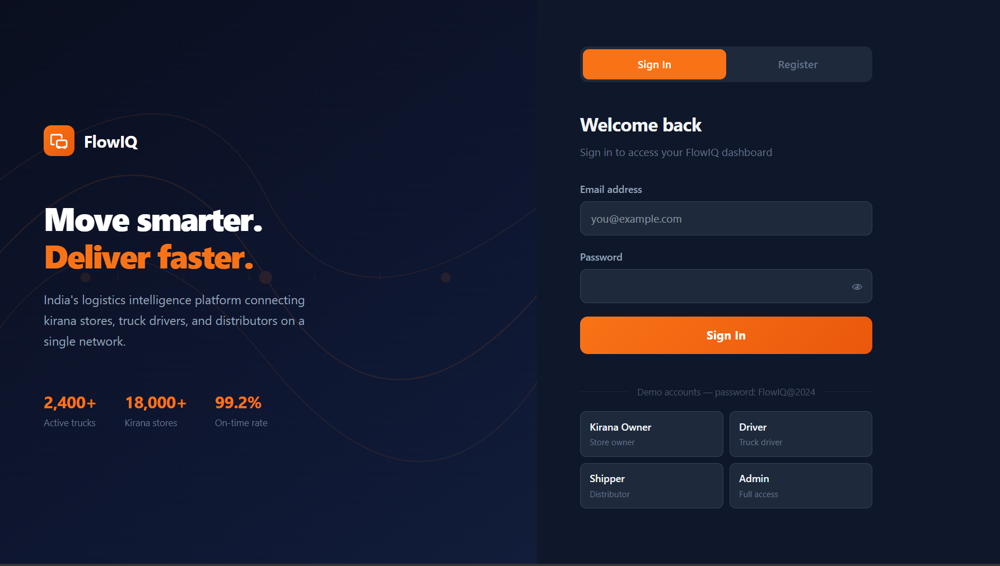
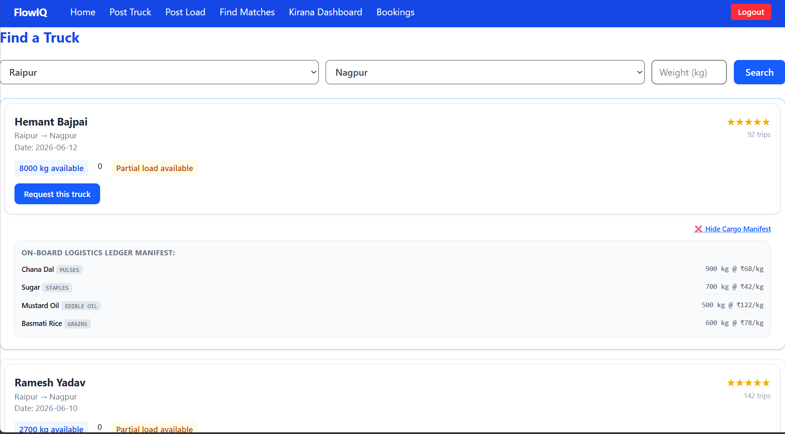
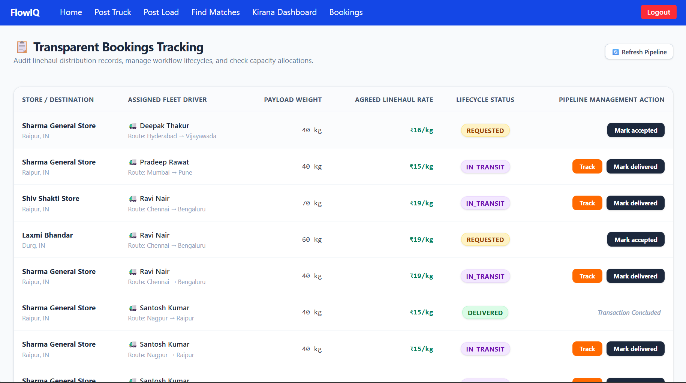
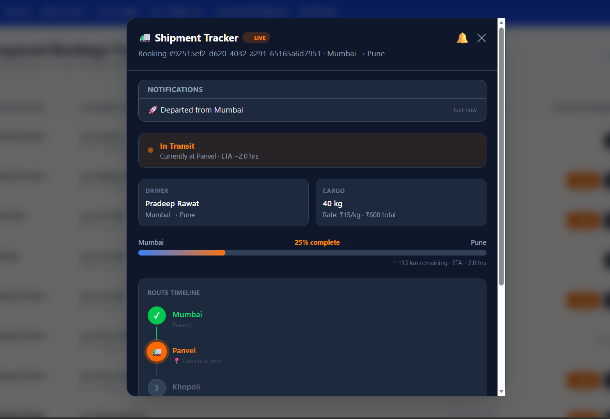
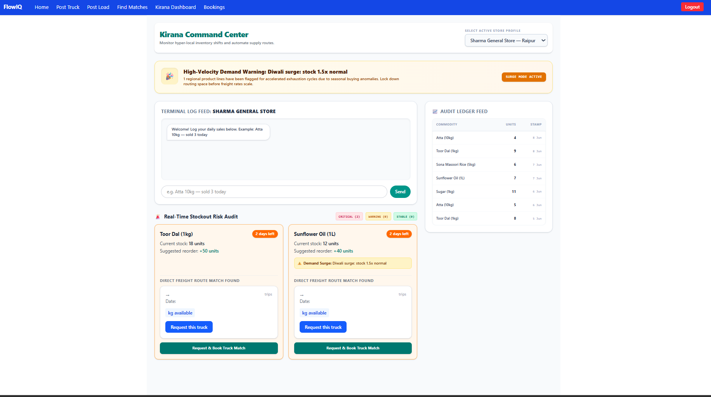

<div align="center">

# ⚡ FlowIQ

### _Transform how people, goods and services move through smarter solutions_

[](https://reactjs.org/)
[](https://vitejs.dev/)
[](https://tailwindcss.com/)
[](https://fastapi.tiangolo.com/)
[](https://supabase.com/)
[](https://www.python.org/)

[](https://vercel.com/)
[](https://render.com/)
[](https://supabase.com/)
[](LICENSE)
[](CONTRIBUTING.md)

<br/>

**FlowIQ** is a logistics and freight coordination platform that connects shippers, drivers, and kirana store owners through load matching, booking management, and shipment tracking.

[🚀 Live Demo](https://flowiq-swart.vercel.app) · [📖 Setup Guide](#setup--installation) · [🐛 Report Bug](https://github.com/tripti-inlayers/flowiq/issues)

<br/>

</div>

---

## 📋 Table of Contents

- [The Problem](#-the-problem)
- [Our Solution](#-our-solution)
- [Features](#-features)
- [Architecture](#-architecture)
- [Tech Stack](#-tech-stack)
- [Project Structure](#-project-structure)
- [Setup & Installation](#-setup--installation)
- [Environment Variables](#-environment-variables)
- [User Roles & Access](#-user-roles--access)
- [Screenshots](#-screenshots)
- [Deployment](#-deployment)
- [Future Scope](#-future-scope)
- [Contributors](#-contributors)

---

## 🚨 The Problem

India's last-mile logistics ecosystem is fragmented and costly — especially for small businesses:

- 🏪 **Kirana store owners** have little to no visibility into their shipment status and rely on phone calls for updates
- 🚛 **Truck drivers** frequently run with partially filled loads, losing revenue due to poor capacity utilization
- 📦 **Shippers** struggle to find reliable, affordable freight options with transparent pricing
- 📉 **Existing platforms** are built for large operators and exclude smaller players who need flexible, low-cost solutions

The result: inefficient routes, wasted capacity, opaque pricing, and frustrated businesses at every link in the chain.

---

## 💡 Our Solution

FlowIQ is a **unified logistics intelligence platform** that brings shippers, drivers, and kirana store owners onto a single transparent system:

| Role | What They Can Do |
|---|---|
| 🚛 **Drivers** | Post available truck capacity with route and pricing details |
| 📦 **Shippers** | Post loads and get matched with suitable trucks instantly |
| 🏪 **Kirana Owners** | Monitor active bookings and track deliveries end-to-end |
| 👤 **Admins** | Oversee platform activity and manage all users |

> No more phone-based coordination. No more empty trucks. No more invisible shipments.

---

## ✨ Features

### 🔐 Authentication & Authorization
- User registration and login with secure JWT-based authentication
- Protected routes with automatic redirect for unauthenticated users
- Role-based access control (RBAC) — each role sees only what it needs

### 👥 User Roles
- **Admin** — platform-wide visibility and user management
- **Driver** — post trucks, manage bookings, update shipment status
- **Shipper** — post loads, discover matches, track shipments
- **Kirana Owner** — monitor deliveries, view booking history

### 🚚 Logistics Core
- **Truck Posting** — drivers list available capacity with route, date, and rate
- **Load Posting** — shippers post freight requirements with origin, destination, and weight
- **Match Discovery** — intelligent matching of loads with available trucks
- **Booking Management** — full booking lifecycle from request to delivery
- **Booking Lifecycle** — `requested → accepted → in_transit → delivered`

### 📍 Shipment Tracking
- Simulated real-time tracking with route waypoints between cities
- Live progress bar and ETA estimation
- Driver and cargo information panel
- Delivery notifications and status updates
- Route timeline visualization

### 🎨 UI/UX
- Responsive dashboards for every role
- Role-aware navigation — menus adapt to the logged-in user
- Modern logistics-themed interface with consistent branding

---

## 🏗 Architecture

```
┌─────────────────────────────────────────────────────────────┐
│                        CLIENT LAYER                         │
│              React + Vite + Tailwind CSS                    │
│         (AuthContext · ProtectedRoute · Role Nav)           │
└───────────────────────┬─────────────────────────────────────┘
                        │ HTTPS / REST
                        ▼
┌─────────────────────────────────────────────────────────────┐
│                        API LAYER                            │
│                    FastAPI (Python)                         │
│        (JWT Auth · RBAC Middleware · Route Guards)          │
│                                                             │
│   /auth/*   /trucks/*   /loads/*   /bookings/*   /matches/* │
└───────────────────────┬─────────────────────────────────────┘
                        │ Supabase Client
                        ▼
┌─────────────────────────────────────────────────────────────┐
│                      DATA LAYER                             │
│                  Supabase (PostgreSQL)                      │
│     users · trucks · loads · bookings · stores              │
└─────────────────────────────────────────────────────────────┘
```

**Data Flow:**
1. User authenticates via FastAPI → receives a signed JWT
2. Frontend stores the token and attaches it to every API request
3. FastAPI validates the token and enforces role-based permissions
4. Supabase handles all persistent data storage and relational queries

---

## 🛠 Tech Stack

| Layer | Technology | Purpose |
|---|---|---|
| Frontend | React 18 + Vite | UI framework and build tool |
| Styling | Tailwind CSS | Utility-first responsive styling |
| Charts | Recharts | Data visualization in dashboards |
| Backend | FastAPI (Python) | REST API and business logic |
| Auth | JWT (python-jose + passlib) | Stateless authentication |
| Database | Supabase (PostgreSQL) | Relational data + Auth |
| ORM/Client | Supabase Python Client | Database interactions |
| Deployment | Vercel + Render | Frontend + Backend hosting |
| Version Control | GitHub | Source control and collaboration |

---

## 📁 Project Structure

```
flowiq/
├── frontend/                     # React + Vite application
│   ├── public/
│   ├── src/
│   │   ├── components/           # Reusable UI components
│   │   │   ├── Navbar.jsx
│   │   │   ├── ProtectedRoute.jsx
│   │   │   └── ...
│   │   ├── context/
│   │   │   └── AuthContext.jsx   # Global auth state + token management
│   │   ├── hooks/
│   │   │   └── useCurrentUser.js # Inject user context into pages
│   │   ├── pages/
│   │   │   ├── LoginPage.jsx
│   │   │   ├── PostTruck.jsx
│   │   │   ├── PostLoad.jsx
│   │   │   ├── Matches.jsx
│   │   │   ├── Bookings.jsx
│   │   │   ├── ShipmentTracker.jsx
│   │   │   └── KiranaDashboard.jsx
│   │   ├── App.jsx               # Routes + role-based redirect logic
│   │   └── main.jsx
│   ├── vercel.json               # SPA routing config for Vercel
│   ├── .env.development
│   └── package.json
│
├── backend/                      # FastAPI application
│   ├── auth/
│   │   ├── config.py             # JWT settings
│   │   ├── schemas.py            # Pydantic models
│   │   ├── router.py             # /auth/* endpoints
│   │   └── guards.py            # Route protection decorators
│   ├── db/
│   │   └── connection.py         # Supabase client setup
│   ├── routers/
│   │   ├── trucks.py
│   │   ├── loads.py
│   │   ├── matches.py
│   │   └── bookings.py
│   ├── migrations/
│   │   └── 001_initial_schema.sql
│   ├── main.py                   # FastAPI app + CORS config
│   └── requirements.txt
│
└── README.md
```

---

## ⚙️ Setup & Installation

### Prerequisites

Ensure you have the following installed:

- [Node.js](https://nodejs.org/) v18+
- [Python](https://www.python.org/) 3.10+
- [Git](https://git-scm.com/)
- A [Supabase](https://supabase.com/) project (free tier works)

---

### 1. Clone the Repository

```bash
git clone https://github.com/your-username/flowiq.git
cd flowiq
```

---

### 2. Backend Setup

```bash
# Navigate to the backend folder
cd backend

# Create and activate a virtual environment
python -m venv venv
source venv/bin/activate        # On Windows: venv\Scripts\activate

# Install dependencies
pip install -r requirements.txt

# Run the development server
uvicorn main:app --reload --port 8000
```

The API will be live at `http://localhost:8000`.
Interactive docs available at `http://localhost:8000/docs`.

---

### 3. Frontend Setup

```bash
# Navigate to the frontend folder
cd frontend

# Install dependencies
npm install

# Start the development server
npm run dev
```

The app will be live at `http://localhost:5173`.

---

### 4. Database Setup

1. Create a project at [supabase.com](https://supabase.com)
2. Open the **SQL Editor** in your Supabase dashboard
3. Run the migration file:

```bash
# Copy contents of backend/migrations/001_initial_schema.sql
# and execute in the Supabase SQL Editor
```

4. Verify that the `users`, `trucks`, `loads`, `bookings`, and `stores` tables were created under the **Table Editor**.

---

## 🔑 Environment Variables

### Backend — create a `.env` file inside `/backend`

```env
SUPABASE_URL=https://your-project.supabase.co
SUPABASE_SERVICE_ROLE_KEY=your_service_role_key
SUPABASE_ANON_KEY=your_anon_key
JWT_SECRET_KEY=your_jwt_secret_from_supabase
FRONTEND_URL=http://localhost:5173
```

### Frontend — create a `.env.development` file inside `/frontend`

```env
VITE_API_URL=http://localhost:8000
VITE_SUPABASE_URL=https://your-project.supabase.co
VITE_SUPABASE_ANON_KEY=your_anon_key
```

> ⚠️ **Never commit `.env` files to GitHub.** Add them to `.gitignore` before your first push. The `service_role` key bypasses Row Level Security — keep it server-side only.

---

## 👤 User Roles & Access

FlowIQ implements role-based access control across every route and API endpoint.

| Role | Default Route | Key Capabilities |
|---|---|---|
| `admin` | `/admin` | Full platform visibility, user management |
| `driver` | `/post-truck` | Post trucks, accept bookings, update shipment status |
| `shipper` | `/post-load` | Post loads, view matches, create bookings |
| `kirana_owner` | `/kirana` | View deliveries, track shipments, booking history |

### Demo Accounts

| Role | Email | Password |
|---|---|---|
| Admin | `admin@flowiq.com` | `FlowIQ@2024` |
| Driver | `driver@flowiq.com` | `FlowIQ@2024` |
| Shipper | `shipper@flowiq.com` | `FlowIQ@2024` |
| Kirana Owner | `kirana@flowiq.com` | `FlowIQ@2024` |

---

## 📸 Screenshots

| Page | Preview |
|---|---|
| Login |  |
| Load Matching |  |
| Booking Management |  |
| Shipment Tracker |  |
| Kirana Dashboard |  |
---

## 🚀 Deployment

FlowIQ is deployed across three platforms:

| Service | Platform | URL |
|---|---|---|
| Frontend | Vercel | `https://flowiq.vercel.app` |
| Backend API | Render | `https://flowiq-backend.onrender.com` |
| Database | Supabase | Managed PostgreSQL |

### Frontend — Vercel

[](https://vercel.com/new/clone?repository-url=https://github.com/your-username/flowiq)

1. Connect your GitHub repository to Vercel
2. Set the root directory to `frontend`
3. Add environment variables (`VITE_API_URL`, `VITE_SUPABASE_URL`, `VITE_SUPABASE_ANON_KEY`)
4. Deploy — Vercel auto-detects Vite

### Backend — Render

1. Create a new **Web Service** on [Render](https://render.com)
2. Connect your GitHub repository
3. Set root directory to `backend`, build command to `pip install -r requirements.txt`
4. Set start command to `uvicorn main:app --host 0.0.0.0 --port $PORT`
5. Add all backend environment variables
6. Deploy

> 💡 **Cold starts:** Render's free tier sleeps after 15 minutes of inactivity. Open `https://flowiq-backend-2uvf.onrender.com/docs#/` a couple of minutes before your demo to wake it up.

---

## 🔭 Future Scope

FlowIQ is built with extensibility in mind. Planned enhancements include:

- 🗺️ **Interactive Map Visualization** — live route maps using Leaflet or Google Maps API
- 📡 **Live GPS Integration** — real-time driver location updates via device GPS
- 🧠 **Predictive ETA Analytics** — ML-based arrival time predictions using historical data
- 🔔 **Advanced Notifications** — WhatsApp / SMS alerts for booking status changes
- 🔀 **Freight Pooling Optimization** — algorithmically merge partial loads across routes
- 📊 **Analytics Dashboard** — platform-wide logistics insights for admins
- 🌐 **Regional Language Support** — Hindi and other Indian language interfaces
- 📱 **Mobile App** — React Native companion app for drivers on the road

---

## 🤝 Contributors

This project was built as part of a hackathon submission.

| Name | GitHub |
|------|--------|
| Tripti Patel | [tripti-inlayers](https://github.com/tripti-inlayers) |
| Raghib Aftab | [raghib-aftab](https://github.com/raghib-aftab) |
---

<div align="center">

**Built with ❤️ for India's logistics ecosystem**

_FlowIQ — Transform how people, goods and services move through smarter solutions_

⭐ If you found this project interesting, consider giving it a star!

</div>
